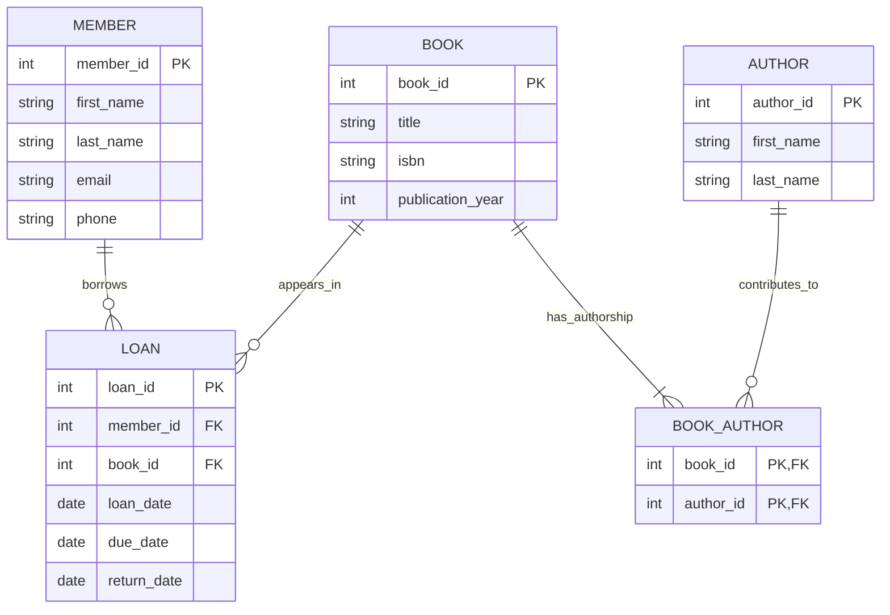

# Лабораторна робота №1

**Тема роботи:** «Збір вимог та розробка схеми ER».  
**Тема системи:** «Система управління бібліотекою».

## 1. Мета роботи

Зібрати вимоги до системи управління бібліотекою, визначити її сутності, атрибути, первинні ключі та зв’язки. На основі вимог побудувати концептуальну ER-модель.

## 2. Призначення системи

Система допомагає бібліотекарю вести облік читачів, книг, авторів та позик. Вона дозволяє знайти книгу, оформити її видачу, зафіксувати повернення і перевірити прострочені позики.

**Межі моделі:** у цій роботі один запис BOOK представляє одну книгу, доступну для видачі. Облік кількох примірників одного видання, бронювання, штрафів і працівників не входить до моделі. ISBN зберігається як характеристика видання, але не є первинним ключем і не має вимоги унікальності.

## 3. Вимоги зацікавленої сторони

Основна зацікавлена сторона — бібліотекар. Йому потрібно:

- реєструвати читачів і змінювати їхні контактні дані;
- додавати книги та авторів, указувати авторів кожної книги;
- шукати книги за назвою, ISBN або автором;
- оформлювати видачу лише доступної книги зареєстрованому читачу;
- бачити, хто взяв книгу та коли її потрібно повернути;
- фіксувати повернення, переглядати історію та прострочені позики.

Читач зацікавлений у правильному обліку своїх позик та зрозумілих строках повернення. Окремий обліковий запис або інтерфейс читача в цій лабораторній не моделюється.

## 4. Дані, які зберігає система

Система зберігає ім’я, прізвище та контакти читача; назву, ISBN і рік видання книги; ім’я та прізвище автора. Для кожної позики зберігаються читач, книга, дата видачі, строк повернення і фактична дата повернення. Окремо зберігаються пари «книга — автор».

## 5. Основні операції

1. Додавання та редагування читача.
2. Додавання та редагування книги й автора.
3. Прив’язування авторів до книги.
4. Пошук книг і перевірка їх доступності.
5. Створення позики із зазначенням читача, книги та дат.
6. Повернення книги: заповнення return_date у відповідній позиці LOAN.
7. Перегляд історії позик читача або книги.
8. Перегляд прострочень: return_date не заповнена, а due_date менша за поточну дату.

## 6. Бізнес-правила та обмеження

- Кожна сутність має первинний ключ. Значення PK обов’язкові та унікальні.
- Кожна позика належить рівно одному читачу і стосується рівно однієї книги.
- Читач і книга можуть існувати без позик.
- Одна книга може мати багато позик у різний час, але лише одну незавершену позику одночасно.
- Незавершена позика має порожню return_date. Доступність книги визначається за відсутністю такої позики.
- due_date не може бути раніше loan_date. Заповнена return_date також не може бути раніше loan_date.
- Повернення після due_date дозволене: це прострочене повернення.
- Кожна книга має щонайменше одного автора. Автор може бути внесений до системи до додавання його книг.
- У BOOK_AUTHOR одна пара book_id та author_id може бути записана лише один раз.
- Посилання на читача, книгу чи автора повинні вказувати на наявний запис.
- Не можна видаляти читача або книгу, якщо на них посилаються позики, чи автора, якщо він пов’язаний із книгою. Це зберігає історію і цілісність даних.
- Імена, прізвища та назва книги не можуть бути порожніми. Контакти читача необов’язкові.
- ISBN і publication_year можуть бути невідомі. Якщо рік задано, це додатне ціле число; якщо ISBN задано, він має коректний формат ISBN-10 або ISBN-13.

Повний перелік вимог наведено у [requirements.md](requirements.md).

## 7. Сутності, атрибути та ключі

Позначення: **PK** — первинний ключ, **FK** — посилання на ключ іншої сутності. Типи наведено для зрозумілості моделі; це не SQL-схема. Необов’язкові атрибути можуть бути порожніми.

### MEMBER — читач

| Атрибут | Тип | Обов’язковий | Призначення |
| --- | --- | --- | --- |
| member_id | int | Так | PK, унікальний ідентифікатор читача |
| first_name | string | Так | Ім’я |
| last_name | string | Так | Прізвище |
| email | string | Ні | Електронна пошта |
| phone | string | Ні | Телефон |

### BOOK — книга

| Атрибут | Тип | Обов’язковий | Призначення |
| --- | --- | --- | --- |
| book_id | int | Так | PK, унікальний ідентифікатор книги |
| title | string | Так | Назва |
| isbn | string | Ні | ISBN видання; рядок зберігає початкові нулі та символ X |
| publication_year | int | Ні | Рік видання |

### AUTHOR — автор

| Атрибут | Тип | Обов’язковий | Призначення |
| --- | --- | --- | --- |
| author_id | int | Так | PK, унікальний ідентифікатор автора |
| first_name | string | Так | Ім’я |
| last_name | string | Так | Прізвище |

### LOAN — позика

| Атрибут | Тип | Обов’язковий | Призначення |
| --- | --- | --- | --- |
| loan_id | int | Так | PK, унікальний ідентифікатор позики |
| member_id | int | Так | FK → MEMBER.member_id |
| book_id | int | Так | FK → BOOK.book_id |
| loan_date | date | Так | Дата видачі |
| due_date | date | Так | Останній день своєчасного повернення |
| return_date | date | Ні | Фактична дата повернення; порожня до повернення |

### BOOK_AUTHOR — авторство книги

| Атрибут | Тип | Обов’язковий | Призначення |
| --- | --- | --- | --- |
| book_id | int | Так | Частина складеного PK; FK → BOOK.book_id |
| author_id | int | Так | Частина складеного PK; FK → AUTHOR.author_id |

**Первинний ключ BOOK_AUTHOR — пара (book_id, author_id).** Окремо book_id або author_id не є унікальними: книга може мати кількох авторів, а автор — кілька книг.

## 8. Зв’язки та кардинальність

| Зв’язок | Кардинальність | Пояснення |
| --- | --- | --- |
| MEMBER → LOAN | 1:N | Один читач має 0..N позик; кожна позика має рівно одного читача |
| BOOK → LOAN | 1:N | Одна книга має 0..N позик за весь час; кожна позика стосується рівно однієї книги |
| BOOK → BOOK_AUTHOR | 1:N | Одна книга має 1..N записів авторства; кожен запис належить рівно одній книзі |
| AUTHOR → BOOK_AUTHOR | 1:N | Один автор має 0..N записів авторства; кожен запис посилається рівно на одного автора |
| BOOK ↔ AUTHOR | M:N через BOOK_AUTHOR | Книга може мати кількох авторів, а автор може написати кілька книг |

Зв’язків 1:1 у цій моделі немає: вимоги їх не потребують. Зв’язок M:N розкладається на два зв’язки 1:N через асоціативну сутність BOOK_AUTHOR.

## 9. ER-діаграма

Окремий файл діаграми з поясненнями: [er-diagram.md](er-diagram.md). Обмеження дат і заборона двох незавершених позик для однієї книги описані текстом, оскільки самі позначення кардинальності їх не виражають.

## 10. Висновок

У роботі визначено вимоги до бібліотечної системи та побудовано ER-модель із п’яти сутностей. Для кожної сутності визначено атрибути й PK. Позики пов’язують читачів із книгами, а BOOK_AUTHOR реалізує зв’язок M:N між книгами й авторами. Модель є основою для подальшої розробки бази даних.

Короткий матеріал для усного захисту: [DEFENSE.md](DEFENSE.md).
