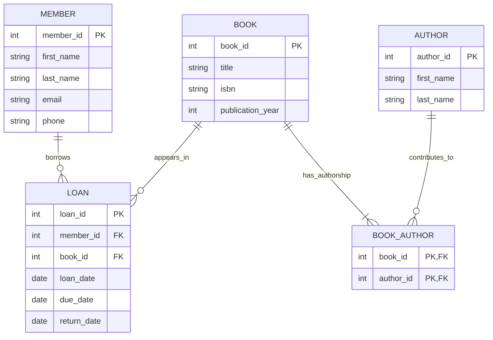

# ER-діаграма системи управління бібліотекою

Діаграма використовує Mermaid ER Diagram. GitHub відображає її у Markdown-блоці з позначкою `mermaid`.

## Позначення

- `||` — рівно один запис.
- `o{` — від нуля до багатьох записів.
- `|{` — від одного до багатьох записів.
- PK — первинний ключ; FK — посилання на ключ іншої сутності.
- Позначки PK у BOOK_AUTHOR разом утворюють один складений ключ (book_id, author_id).

Типи int, string і date пояснюють вид даних і не задають SQL-реалізацію. Обов’язковість атрибутів наведено у [звіті](README.md).

## Пояснення кожного зв’язку

| Лінія діаграми | Тип | Пояснення |
| --- | --- | --- |
| MEMBER → LOAN, borrows | 1:N | Читач може мати 0..N позик. Кожна позика належить рівно одному читачу через LOAN.member_id |
| BOOK → LOAN, appears_in | 1:N | Книга може мати 0..N позик у різний час. Кожна позика стосується рівно однієї книги через LOAN.book_id |
| BOOK → BOOK_AUTHOR, has_authorship | 1:N | Книга має 1..N записів авторства. Кожен запис посилається на одну книгу через BOOK_AUTHOR.book_id |
| AUTHOR → BOOK_AUTHOR, contributes_to | 1:N | Автор може мати 0..N записів авторства. Кожен запис посилається на одного автора через BOOK_AUTHOR.author_id |

Разом два останні зв’язки реалізують **BOOK M:N AUTHOR**. Наприклад, записи (book_id=1, author_id=1), (book_id=1, author_id=2) та (book_id=2, author_id=1) означають: книга 1 має двох авторів, а автор 1 пов’язаний із двома книгами. Складений PK забороняє повторення тієї самої пари.

Зв’язків 1:1 немає. Окрема пряма лінія M:N між BOOK та AUTHOR не потрібна: цей зв’язок уже представлений через BOOK_AUTHOR.

## Правила, які доповнюють діаграму

Один запис BOOK представляє одну книгу для видачі. Вона може мати багато позик за весь час, але тільки одну незавершену позику одночасно. Порожня return_date означає, що книгу ще не повернули. due_date і заповнена return_date не можуть бути раніше loan_date. Ці правила не виражаються самою кардинальністю 1:N.
